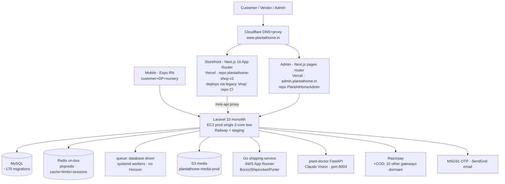

# PlantAtHome — Current Architecture (as-built, 2026-08-10)

Documents what EXISTS, verified against code. Companion docs: [business-flows.md](business-flows.md),
[findings.md](findings.md), [target-architecture.md](target-architecture.md).

## System map

## The dominant architectural fact: two backend stacks

| | Legacy `packages/marvel` (LIVE) | Modular `app/Modules` (`/api/v1`) |
|---|---|---|
| Serves | The storefront + admin today (`POST /api/orders` etc.) | 14 domain modules (Sales, Inventory, Pricing, Catalog, Identity…) |
| Size | 83k lines; `Rest/Routes.php` 1,349 lines; 22 controllers >300 lines (ProductController 1,747) | zero controllers >300 lines; uniform `v1.auth`/`v1.role:` middleware |
| Order path | `OrderController::store` → `OrderRepository::storeOrder` (now: idempotency key, atomic stock gate, post-commit PSP intent) | `CheckoutController` with `Idempotency-Key`, reservations w/ TTL, full test suite |
| Tests | Order/inventory/webhook suites added 2026-08-10 | `Feature/Sales`, `Feature/Inventory`, e2e `money-path.mjs` |

The v1 stack is the proven pattern; the storefront still calls the marvel stack. Migration is the
roadmap's biggest item ([modernization-roadmap.md](modernization-roadmap.md)).

## Frontend architecture

- **Storefront** `plantathome-shop-v2`: Next.js 16 App Router, React 19, npm. Runtime data via
  `@tanstack/react-query` v5 behind a **v3 compat shim** (`src/compat/react-query.tsx`, tsconfig
  alias). Design tokens: CSS custom properties (`main.css :root`) consumed by Tailwind; live-themeable
  via `settings.options.designSystem`. Icons: Lucide-only via `src/components/ui/icon.tsx` funnel
  (docs/design/icon-system.md). SSR product fetch is city-less (ISR); city pricing overlays client-side
  through `useCityPrice` — the server is the single price source (`attachCityPricing`,
  `overlayCityPrices` on every public feed).
- **Admin** `admin/rest`: Next.js pages router, genuine react-query v3, richer `ui/` kit. Static
  evidence pages: Security Audit (hand-maintained TS dataset) and Performance (machine-derived JSON
  from `api/tests/Performance/build_report.mjs`).
- **Mobile** `plantathome-app`: Expo RN, single Lucide icon funnel, Sanctum token auth. Cannot run in
  Expo Go (native modules).

## Backend architecture (marvel, the live core)

- **Routing tiers** in `Rest/Routes.php`: public (per-route throttles), `auth:sanctum` groups,
  permission groups (67 `permission:` usages, 96-perm RBAC with designations/overrides), super-admin.
- **Services**: `AvailabilityService` (city projection `product_city_availability`, per-variant rows,
  variant 0 = rollup), `PricingService`/`MarginResolver` (flat-₹ city margins — the ONLY margin
  formula), `OrderItemService` (line assignment; reservation calls flag-gated OFF),
  `BundleInventoryService` (derived MIN over components), `ApiResponseCache` (version-keyed response
  cache + `rememberWithLock` stampede lock).
- **Events/listeners**: 27 events / 31 listeners. Order lifecycle: `OrderProcessed` → synchronous
  `ProductInventoryDecrement` (atomic conditional UPDATE, policy-gated blocking); `OrderCancelled` →
  idempotent `ProductInventoryRestore` (`orders.inventory_restored` guard). Notifications are queued
  (`after_commit` now enforced).
- **Scheduler**: 14 entries (availability recompute, settlements, outbox relay, marketing dispatch,
  log pruning, **orders:cancel-stale-unpaid** — new).

## Data architecture

- 170 migrations (82% dated 2026 — young, fast-moving schema). Key invariants:
  `orders.tracking_number` UNIQUE; `orders.idempotency_key` UNIQUE (new);
  `coupon_usages (coupon_id, order_id)` UNIQUE; `product_city_availability
  (product_id, city, variation_option_id)` UNIQUE; vendor ledger UNIQUE per order.
- Stock semantics: `products.quantity`/`variation_options.quantity` are the transactional counters
  (atomic decrement at order creation; restore on cancel/refund); `vendor_product_prices` carries
  vendor stock; `product_city_availability.stock` is a derived projection (recomputed, never
  decremented by orders). One concept, three tables — see findings F-12.

## Auth & authorization

Sanctum bearer tokens (30-day expiry), phone OTP via MSG91 with the layered `OtpAbuseGuard`
(cooldown/day-cap/verify-lockout, Redis, fail-open over the `throttle:otp` floor) + social login.
RBAC: enterprise designations + 96 permissions; vendor scoping verified by `RbacTest` +
`v1-authz-security.mjs`.

## Payments

Razorpay live (+ COD in three stored spellings; `PaymentGatewayType::isCashOnDelivery`). Webhook:
signature-verified (raw body), captured-amount recheck, state-based replay idempotency, allowlist
gate (`WEBHOOK_GATEWAYS`) + throttle. Payment intent created AFTER the order transaction commits.
10 other gateway implementations exist but their webhook surfaces 404 unless allowlisted.
⚠️ Production still runs an `rzp_test_` key — the money path has never processed a live payment
(operator item, runbook #1).

## Infrastructure

- **Prod**: single EC2 box (2-core/1910MB) behind Cloudflare: nginx + PHP-FPM, on-box Redis
  (phpredis), MySQL, systemd queue workers (defs hand-synced with Railway's supervisord). Deploy via
  `production.yml` (test-gated, env rewritten per deploy — now includes `SESSION_DRIVER=redis`).
- **Staging**: Railway (`git push origin HEAD:staging`), `CACHE_DRIVER=file` (divergence noted in
  findings), queue=database.
- **Measured capacity**: ~122 RPS origin ceiling (~61 RPS/core, framework-bound, not query-bound) —
  see docs/performance/performance-baseline.md.
- **12 satellite services** exist in the workspace (shipping-service, plant-doctor, analytics, care-plan,
  chatbot, media, image, recommendation, semantic-search, seo + Porter/Shiprocket helpers); only
  shipping-service and plant-doctor are load-bearing today.

## Observability

Structured request logging (LogRequests → request_logs w/ IP enrichment), Mission Control + NOC
(`/live-activity`), `/setup/logs`, platform heartbeats, integration health checks hourly.
Health: `/health` (compat), `/health/live` (dependency-free), `/health/ready` (DB + cache probes,
200/503). No APM/metrics backend (roadmap).
