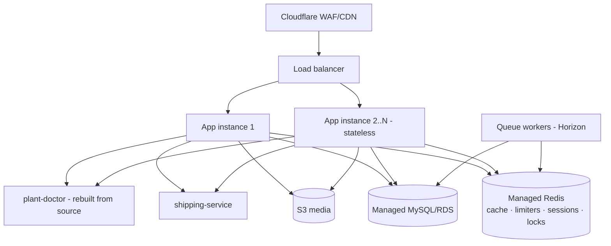

# PlantAtHome — Target Architecture

The target is a **consolidated modular monolith** — not microservices. The evidence says the
monolith is the right shape at this scale (framework overhead, not domain contention, is the
bottleneck); the problem is that TWO monolith generations coexist and the older one carries the
money path.

## Target state

## Principles (mandate-aligned)

1. **One order stack.** `app/Modules/Sales` + `Inventory` (idempotency keys, TTL reservations,
   tested money path) become the only checkout; marvel's order path is retired route-by-route behind
   the `/api/v1` surface. Until then, the marvel path carries the same guarantees (done this pass:
   idempotency, atomic stock gate, webhook hardening).
2. **Domain ownership, no duplication.** PricingService owns price; AvailabilityService owns the
   city projection; CouponRepository owns redemption; InventoryService (v1) owns reservation;
   PaymentService owns gateway state. Anything computing these elsewhere is a bug.
3. **Stateless app tier.** Sessions/cache/limiters in shared Redis (sessions done; Redis must move
   off-box before instance #2). No local filesystem writes outside temp (media already S3).
4. **Boring infra, bought not built**: ALB + 2 small instances beats one big box (deploys without
   downtime, instance loss ≠ outage); ElastiCache; RDS. No Kubernetes/Kafka/event-sourcing — nothing
   in the workload justifies them.
5. **Evidence pages stay machine-derived** (perf JSON pattern) — the security dataset gets the same
   treatment eventually.

## What does NOT change

Laravel + Next.js + MySQL + Redis; the marvel catalog/CMS surface (works, cached, measured); the Go
shipping-service boundary (genuinely separate concern, own repo/deploy); Cloudflare in front.

## Sequencing

See [modernization-roadmap.md](modernization-roadmap.md). Order of operations is dictated by risk:
stateless app tier (done in config) → managed Redis → second instance + ALB → storefront checkout
onto `/api/v1` (behind a flag, cohort-rolled) → marvel order-path retirement → controller
decomposition opportunistically (only when a file is being changed anyway — no big-bang rewrites).
